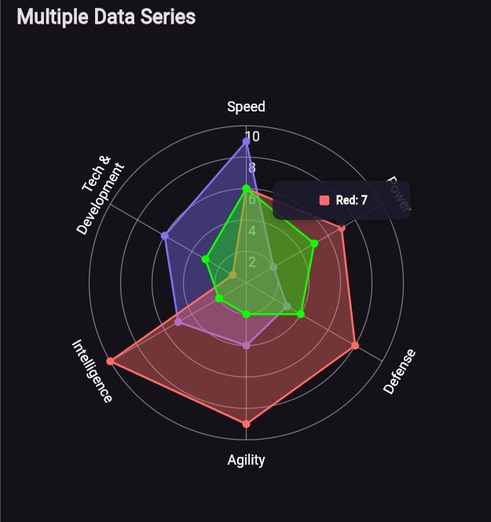

# radar_chart_plus

A customizable radar (spider) chart widget for Flutter.  
This package helps you visualize multi-dimensional data in a clean, interactive radar chart.

---




## Features

- 🎯 Draw radar (spider) charts with ease
- 🎨 Customizable chart colors, labels, and ticks
- 🔵 Optional dots at data points
- 📐 Responsive layout support
- ⚡ Lightweight and dependency-friendly

---

## Getting started
```dart
RadarChartPlus(
  dotColor: Color(0xFF8072F3),
  chartBorderColor: Color(0xFF8072F3),
  chartFillColor: Color(0x668072F3),
  ticks: [2, 4, 6],
  labels: ['AA', 'BB', 'CC'],
  data: [3, 2, 5],
),
```

## Additional information

This package was created to offer a modern, customizable, and lightweight radar chart widget for Flutter applications. Ideal for dashboards, analytics, and performance visualization.
Feel free to contribute, report issues, or request new features on the GitHub repository.

## Contribution

Contributions are welcome! If you'd like to improve the package, follow these steps:

1. Fork the repository

2. Create a new branch for your feature or fix

3. Make your changes with clear commit messages

4. Submit a Pull Request describing what you changed and why

5. The PR will be reviewed and merged if everything looks good

## Contributors

<a href="https://github.com/VishnuB01/radar_chart_plus/graphs/contributors">
  
</a>
